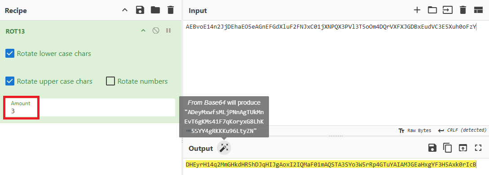
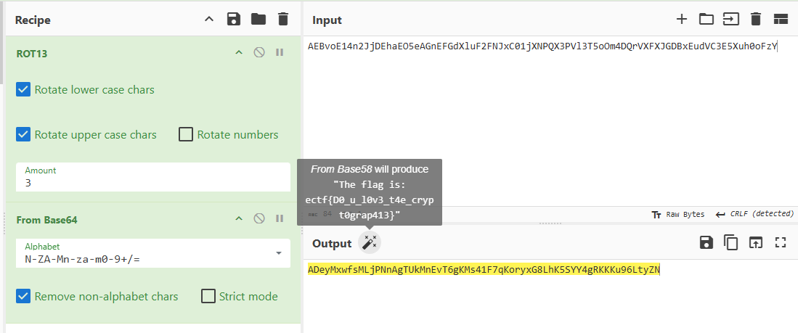
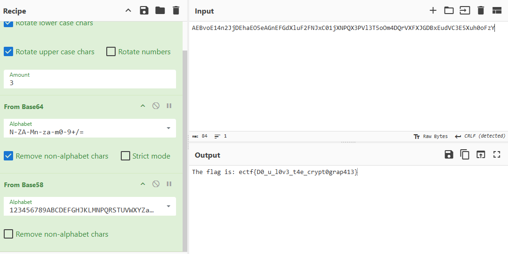

# Never two without three

## Points :500  
## Description :  
> Never two without three. 
Please help me to decode this message, I don't know what is it, maybe Caesar ? I don't know.

`AEBvoE14n2JjDEhaEO5eAGnEFGdXluF2FNJxC01jXNPQX3PVl3T5oOm4DQrVXFXJGDBxEudVC3E5Xuh0oFzY`

## Solution : 	 
The hint "Never two without three" suggests something related to the number three perhaps a shift of three. Given that the challenge mentions Caesar cipher, it’s a good starting point.

I converted the cipher with Caesar using key 3.

and i get then a base58 text 

and last step is decrypte the base58 to text 

`The flag is: ectf{D0_u_l0v3_t4e_crypt0grap413}`