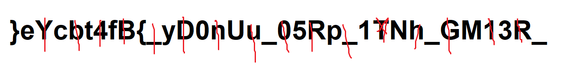

# OIIAIOIIIAI 😼

## Points :200  
## Description :  
> The cat made a mess of the flag , I have to retrieve the flag or my boss will be mad.

`}eYcbt4fB{_yD0nUu_05Rp_1TNh_GM13R_`

## Solution : 	 
This challenge looks hard but its an easy one , it just require a sharp eye to detect the flag 

> Try To Use This Python [Script](main.py) to get the flag

To decode it, I separated characters at odd and even indices. The first part `ch1` collected every second character starting from index 1, while the second part `ch2` collected every second character from index 2. Finally, I reversed `ch2` and concatenated it with `ch1` to reconstruct the flag.

`Flag : ectf{y0U_5p1N_M3_R1GhT_R0unD_B4bY}`