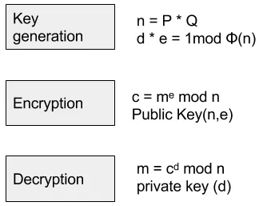

# RSA intro

## Points :250  
## Description :  
> This is just a brief introduction to RSA nothing more nothing less.

## File :	   
> [output.txt](output.txt) 
## Solution : 	 
I was given an RSA challenge with the following parameters:
* N (modulus)
* e (public exponent)
* c (ciphertext)

### Approach:
My task was to decrypt the message.

i used dcode.fr ["prime factors"](https://www.dcode.fr/prime-factors-decomposition) to get the prime factor `p`, and since RSA typically uses two prime numbers, I computed `q` as:
`q = N // p`
and now i can Decrypting the Ciphertext with my [script](dec.py)

### Alternative Method:
Instead of manually computing the decryption steps, you can use dcoder.fr ["rsa-cipher"](https://www.dcode.fr/rsa-cipher) to automate these calculations.  

### Flag
`Plaintext: ectf{b4sic_F4cT0rDb_rS4}`