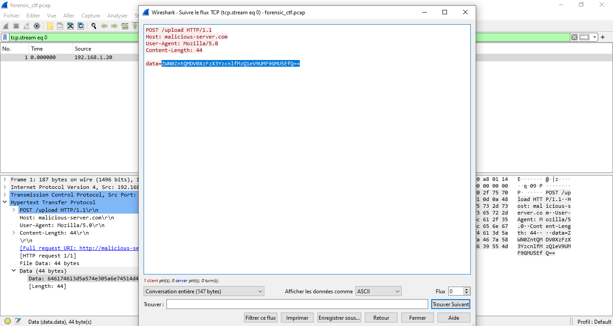
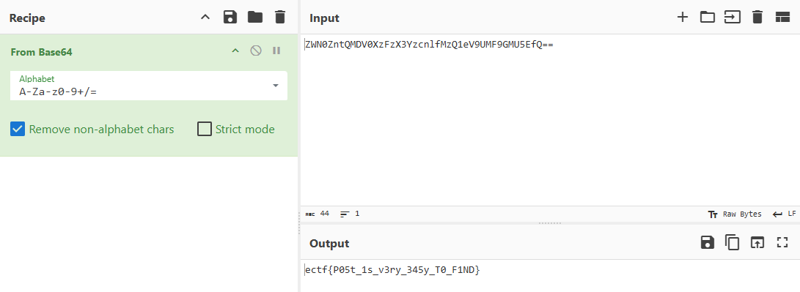

# Capture the hidden

## Points :200  
## Description :  
> A cybersecurity agent intercepted suspicious network traffic before disappearing. The attackers attempted to erase their tracks, but a PCAP file was recovered.
Somewhere within these packets, a crucial file was exfiltrated. Can you analyze the traffic, extract the hidden data, and uncover the secret message?

## File :	   
> [forensic_ctf.pcap](forensic_ctf.pcap) 

## Solution : 	 

`ectf{P05t_1s_v3ry_345y_T0_F1ND}`
