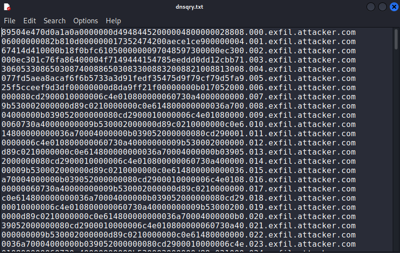

# Just a PCAP

## Points :500  
## Description :  
> An image has been stolen, can you find it in the PCAP file ?

## File :	   
> [justapcap.pcap](justapcap.pcap) 

## Solution : 	 
We were given a PCAP file containing network traffic. The challenge prompt stated that an image had been stolen and asked us to find it.

### 1. Step 1: Inspecting the PCAP File in Wireshark
First, we opened the PCAP file in Wireshark to examine the traffic. Since the prompt mentioned data exfiltration, we looked for suspicious activity.

We noticed that multiple DNS queries were made to subdomains of `exfil.attacker.com`. Each query contained a hex-like data structure.

### Step 2: Extracting the DNS Queries
To extract all queries that contained the stolen data, we used tshark:

`tshark -r justapcap.pcap -Y "dns.qry.name contains \"exfil.attacker.com\"" -T fields -e dns.qry.name > dnsqry.txt`

This saved all the exfiltrated data to dnsqry.txt. The file contained lines like this:

### Step 3: Cleaning and Converting Hex Data
Since only the portion before `.exfil.attacker.com` contained the data, we extracted and cleaned it:

`cat dnsqry.txt | cut -d'.' -f1 > extracted_hex.txt`

Now, extracted_hex.txt contained just the hex-encoded bytes.

Next, we converted this hex data into a binary file:

`xxd -r -p extracted_hex.txt extracted_data.bin`

