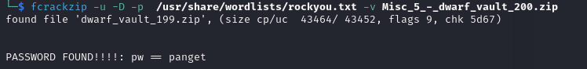
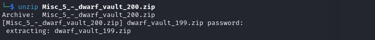
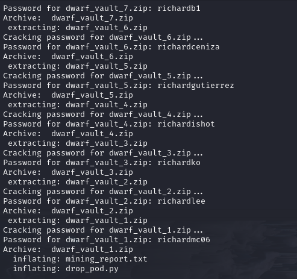
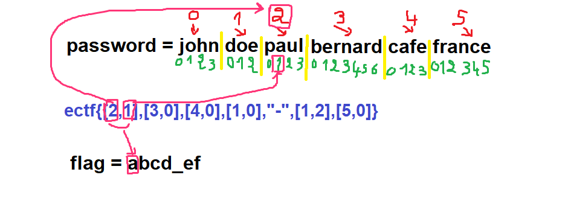
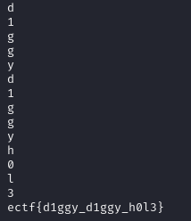

# Extraction Mission Heart of the vault


## Points :450 <br />
## Description : <br />
> The dwarves of Deep Rock Galactic have uncovered a series of hidden vaults, each sealed tighter than the last.
Your mission: crack through the zips, one vault at a time, and uncover what lies beneath.
<br />
This is a programming challenges and is divided in 2 parts. When you arrive at the second part please read
all files, there is some hints already. I advice you to keep ALL the passwords you get and think simple (easier to say when you make the challenge).

## File :	  <br />
> [Misc_5_-_dwarf_vault_200.zip](Misc_5_-_dwarf_vault_200.zip) 


## Solution : 	<br />
### **Step 1: Unzipping the Vaults**

The challenge starts with the file `Misc_5_-_dwarf_vault_200.zip`, which requires a password to unlock. Upon cracking the password and extracting the contents, another ZIP file `dwarf_vault_199.zip` appears. This pattern continues down to `dwarf_vault_1.zip`.





**Automating the Process**

Manually extracting 200 ZIP files would be inefficient, so I wrote a shell script to automate the process:
> USING THIS .sh [CODE](cracker1.sh) 



This script:

- Iterates from ZIP 200 to ZIP 1.
- Extracts each file using its corresponding number as the password.

### **Step 2: Investigating the Final Files**
After extracting dwarf_vault_1.zip, two files were found:

1. [mining_report.txt]()
2. [drop_pod.py](drop_pod.py)

- mining_report.txt Contents
> Mining report - flag coordinates: ectf{[[0, 6], [6, 8], [4, 7], [4, 7], [15, 5], '_', [0, 6], [6, 8], [4, 7], [4, 7], [15, 5], '_', [0, 3], [0, 9], [1, 7], [28, 7]]}

- drop_pod.py Analysis
```py
#Maybe the flag was the friends we made along the way
password = " "

flag = "FAKE FLAG THIS IS NOT REAL"

def find_positions(flag, crew_list):
    positions = []
    for char in flag:
        if char == "_":
            positions.append("_")
            continue
        found = False
        for i, name in enumerate(crew_list):
            if char.lower() in name.lower():
                positions.append([i, name.lower().index(char.lower())])
                found = True
                break
        if not found:
            positions.append([None, None])
    return positions


positions = find_positions(flag, password.split())


output_text = "Mining report - flag coordinates: ectf{" + str(positions) + "}"


with open("mining_report.txt", "w") as file:
    file.write(output_text)


print("Rock and Stone! Report written to mining_report.txt:", output_text)
```

From this, I understood:

- The script generates mining_report.txt using passwords stored in password.split().

- The coordinate pairs refer to character positions within the list of passwords.

**Example how the code work :**



### **Step 3: Extracting the Flag**
After analyzing the scripts, I realized that the **passwords** used for each ZIP file were essential for decoding the flag. I then modified my approach to collect all passwords during extraction and save them in a text file. Once I had the full list of passwords, I used them to decode the flag using the coordinate mapping from `mining_report.txt`.

here is the sh script to collect passwords ---> **[cracker2.sh](cracker2.sh)**
and store them in **[passwords.txt](passwords.txt)**.

now we have the passwords we can decode the flag using this ---> **[script](decoder.py)**.




> PS: (I used `passwords[::-1]` to reverse the list since the passwords were collected in descending order, from `200.zip` down to `1.zip`. Reversing ensures they align correctly with the intended sequence for flag extraction.)


