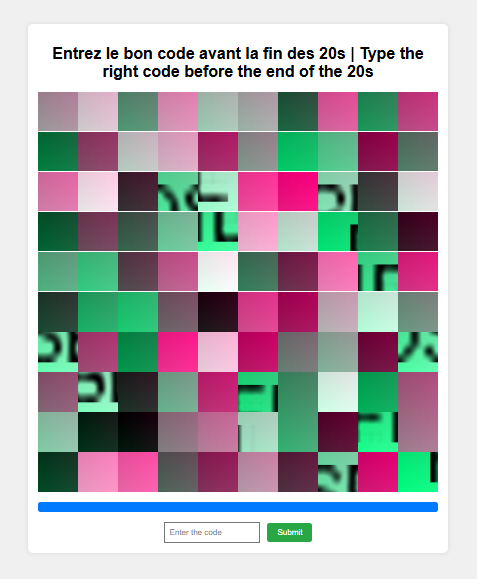
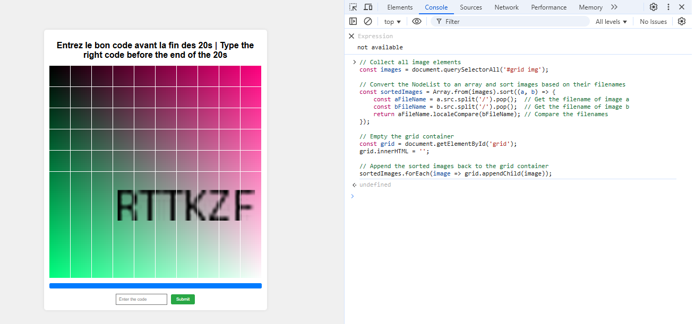
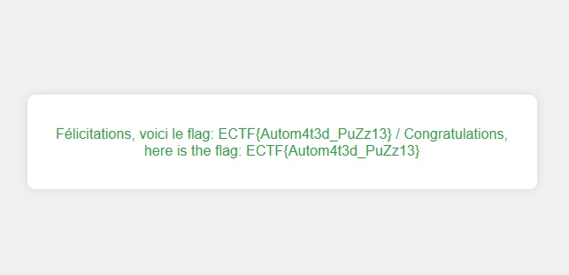

# Lightspeed puzzle

## Points :200  
## Description :  
> We've been told you're good at puzzles, so we're going to test that with a small 100-piece puzzle :).
 
Solve the puzzle and enter the code written on it in less than 10 seconds to get the flag. 
Deploy an instance here : https://instances.ectf.fr
 
Flag format: ECTF{....}
 
If you have a problem solving this challenge, try using a non headless tool to display what happens

## Solution : 	 
- The challenge requires deploying an instance from instances.ectf.fr. Once inside, a large 81-piece puzzle appears on the screen. The goal is to solve the puzzle and enter the code written on it before 10 seconds run out.

    However, solving an 81-piece puzzle manually in such a short time is practically **impossible**. Additionally, the puzzle pieces **do not move**, and each attempt generates a new randomized puzzle.

    

- Instead of solving the puzzle manually, I used JavaScript >[code](TRI.js)< in the browser console to extract and sort the puzzle pieces instantly.

- Final Steps to Retrieve the Flag

    - After running the script, the puzzle was **instantly solved**, **revealing the code** written on it.
    - I quickly entered the code **before the timer expired**.
    - Upon submission, the **flag was displayed** as the challenge reward.

